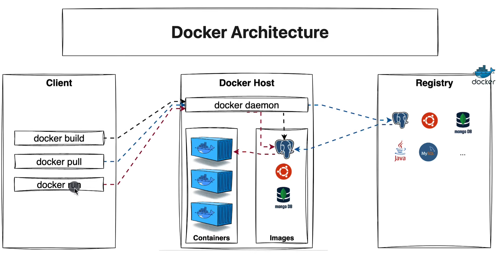
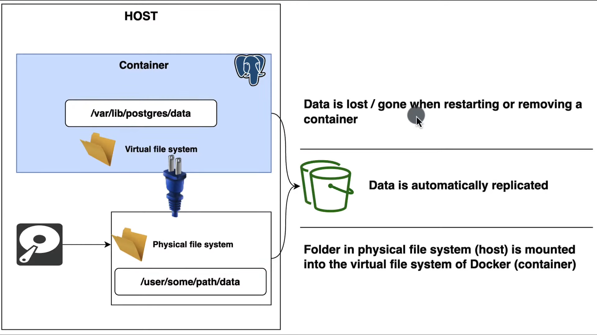
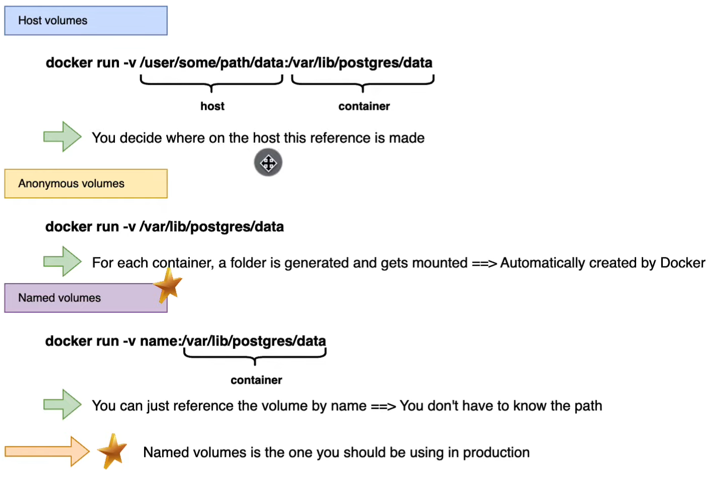
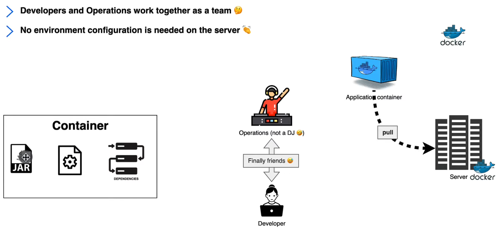
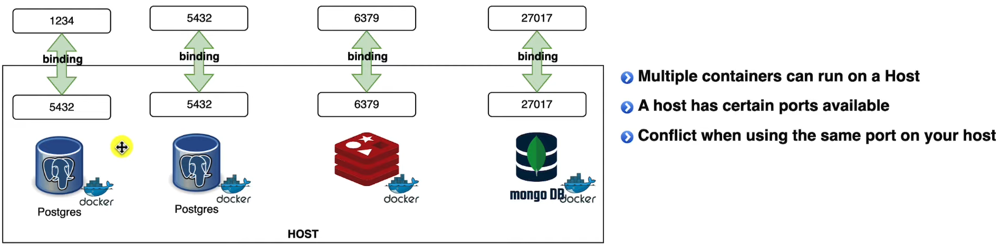
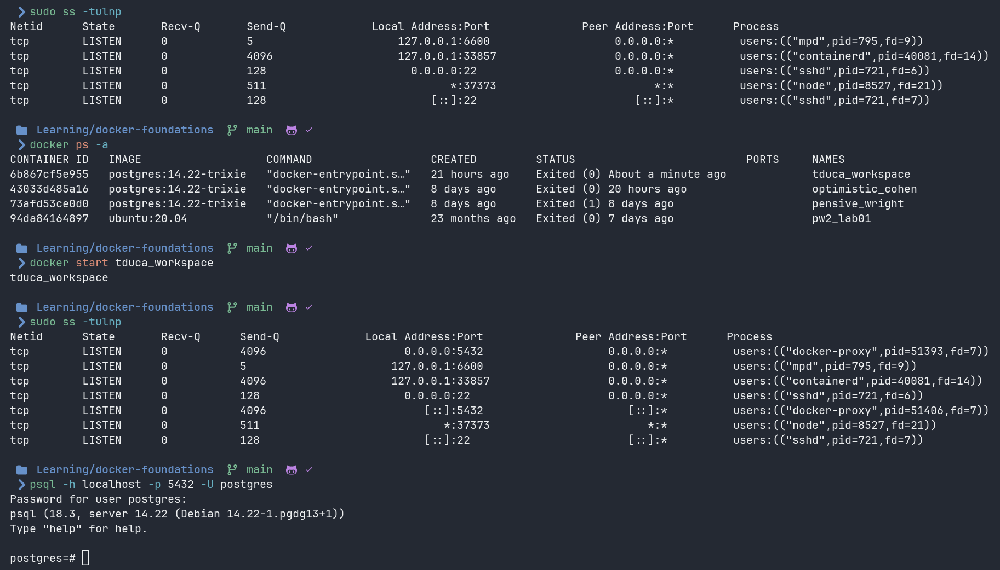
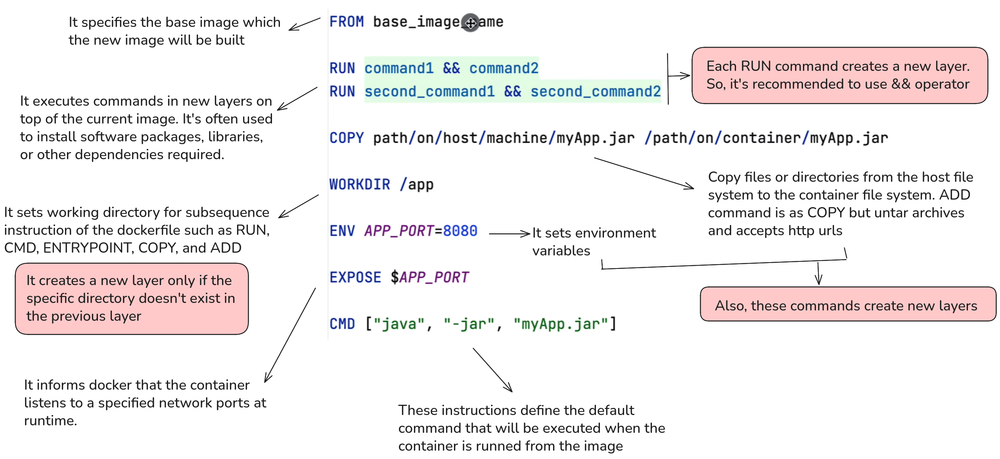

## 1. What is Container?

Lightweight, standalone, and executable software package that includes everything needed to run a piece of software. Simplifies development, deployment and scaling.

> [!IMPORTANT]
> Containers are designed to provide a consistent and reproducible environment across different platforms and development stages.

**Containers benefits** are Consistency, Portability, Resource Efficiency, Scalability, and Versioning and Rollback. 

### 1.1. Where are Containers?

The container can be to include the code runtime system, tools, libraries, and settings. **Container Registries** are services that store and distribute container images allowing developers and creators to push pull and manage images of their application.

Some popular container registries are **Docker Hub, Google Container registry, AWS elastic container registries**, etc.

There are 3 types of containers:

1. Container repositories. We call them self-hosted registries like [Nexus repository](https://www.sonatype.com/products/sonatype-nexus-repository)
2. Private repositories.
3. Public repositories like [Docker Hub](https://hub.docker.com/)

> [!NOTE]
> When deploying a containerized application, the container runtime like Docker, it pulls the relevant container image from the specified registry, it creates a container from the image and it runs it on the host system.

### 1.2. Virtual Machine VS Docker Container

Docker containers share the host operating system and run as isolated user space processes. This approach results in lower resource overhead faster startup times and increased density of applications per host compared to Virtual Machine.


> [!IMPORTANT]
> **Docker** is weel suited for microservices cloud native applications and situations where you need to deploy and scale application **quickly** with minimal overhead.
>Whereas, **Virtual machines** are more appropiate for running application with strong isolation requirements, legacy applications or when you need to run multiple operating system instances on the same host.

## 2. What is a Docker Container?

It is a set of layers of images as we can see in the following image.


### 2.1. What is a image?

A Docker image is a lightweight, standalone, and immutable template that contains everything needed to run an application. It serves as a blueprint for creating Docker containers.

**Components of a Docker image**

Base layer (minimal operating system like Alpine Linux), Application dependencies (libraries, packages, and tools), Application code (actual code and files that make up your application), and Configuration (environment variables, exposed ports, and startup commands)

> [!IMPORTANT]
> When you run a Docker container, it creates a thin writable layer on top of the read-only image layers. Any changes made during container runtime are stored in this writable layer, while the underlying image remains unchanged.

### 2.1. Let’s started with the docker commands

We going to pull a [Postgres image](https://hub.docker.com/_/postgres) from Docker Hub.

```bash
docker pull postgres:14.22-trixie 
```


Eah hash is a layer and when we did a `docker pull` it started pulling the layers one by one.

**Commands about Images**

```bash
docker pull [OPTIONS] <IMAGE>
docker images [OPTIONS] <IMAGE> # Show images
docker image rm <IMAGE> # Remove an imagen, 'docker rmi' is a shortcut
```

**Commands about containers**

We need fast commads to run a new container

```bash
docker run [OPTIONS] <IMAGE> # pull image, create container, and run container
docker run -d <IMAGE> # Background run
docker run --name <NAME_CONTAINER> <IMAGE> # set an alias instead hash
docker start <HASH | NAME> # Start a container that already exist
docker stop <HASH | NAME> # Stop a container
docker logs <HASH | NAME> # Show logs about the container
docker logs --follow <HASH | NAME> # Show listening logs
docker rm <HASH | NAME> # Remove a container
docker ps # Show running container
docker ps -a # Show all containers 
```



### 2.3. Run some commands inside the container

In this case, we’re gonna use `postgres` container and we need run the container or to log into the container in an interactive mode.

```bash
docker exec -it <NAME_CONTAINER> <COMMAND> # exec (execute), it (interactive terminal)
docker exec -it optimistic_cohen psql -U postgres # Connect to PostgreSQL
```

`COMMAND` is a executable program like `psql` (PostgreSQL CLI tool)

## 3. Docker volumes

In our example, the `postgres` container has its own virtual file system. For example, PostgreSQL has a virtual file system called `/var/lib/postgres/data` , so this is where the container is gonna store all the data that you will do on that container like creating a database, tables, inserting, etc; it will be automatically stored on the container.

If we don’t want to lose our data when removing a container, we use this concept.



> [!IMPORTANT]
> All we need to do is **mount** our physical file system, which is our host machine, into this virtual file system.

> [!CAUTION]
> Restarting a container (using `docker stop` and `docker start`) does **not** remove its data. The data in the container's filesystem remains intact during restarts, so volumes are not strictly necessary in this case.
> However, volumes become essential when you **remove a container** (using `docker rm`). When a container is deleted, all data stored in its writable layer is permanently lost.

### 3.1. Volumes types



### 3.2. How we used to deploy after containers?

Finally Developers and Operations are friends and we work together as a team

> [!NOTE]
> No environment configuration is needed on the server—all we need is Docker installed, and then we can just run the commands.



## 4. Port Mapping

When we wanna connect to our PostgreSQL database from outside Docker will throw a exception because it running in an isolated environment belongs to Docker. Therefore, we need to expose ports.



Our PostgreSQL is running on the 5432 port and we have two instances, maybe they have different  PostgreSQL version.

> [!IMPORTANT]
> We can use the same internal (container) port for many different Docker containers, provided they are in their own isolated network namespaces (the default Docker bridge networking behavior). This is a core feature of Docker's isolation.

> [!CAUTION]
> But, when it comes to the host and the port that we want to expose for the host we cannot expose two times the same port. If we do that and try to bind (e.g. change 1234 by 5432), we get message Port already in use.

```bash
docker run -p <HOST_PORT>:<CONTAINER_PORT> <IMAGE> # --publish a container's port(s) to the host
```


> [!IMPORTANT]
> It's not you who makes port `5432` listen on your machine. Docker does it automatically when you declare the `-p` flag. Internally, Docker spins up a proxy process that listens on that host port and forwards traffic into the container.



## 5. `DOCKERFILE`

It’s a text file containing a series of instructions that define how to build a docker image for specific application or service like the base image, dependencies, configuration, and other required components.



> [!IMPORTANT]
> Minimizing the number of layers and leveraging caching can significantly reduce build times and image sizes.

## Questions

- **What is the difference between `run` and `start` commands?**
    
    **`docker run`** creates a *new* container from an image and starts it. It combines three operations: pulling the image (if not present), creating a container, and starting it.
    
    **`docker start`** starts an *existing* container that was previously created but is currently stopped. It resumes a container that already exists.
   
- **Why my container is exited immediately when I executed `docker start <NAME>` ?**
    
    This happens in PostgreSQL image because the official PostgreSQL image requires a password to be set during the initial creation. Without it, the database fails to initialize and the process shuts down immediately.

- Por qué cuando creo e inicio manualmente un contenedor con una imagen de ubuntu:20.04, el contenedor se inicia y se detiene inmediatamente.

- Por qué al crear e iniciar dicho contenedor con el comando 'run' y pasandole la opcion -it recien el contenedor comienza y no se detiene inmediatamente.

- Si partimos de la idea de que al hacer manual el inicio del contenedor, nosotros no estamos pasando ningún proceso al contenedor y es por ello que se detiene inmediatamente. Entonces por qué cuando detengo el contenedor y lo deseo iniciar nuevamente, y lo hago con el comando 'start' recien ahora pasa que el contenedor no se detiene inmediatamente.
