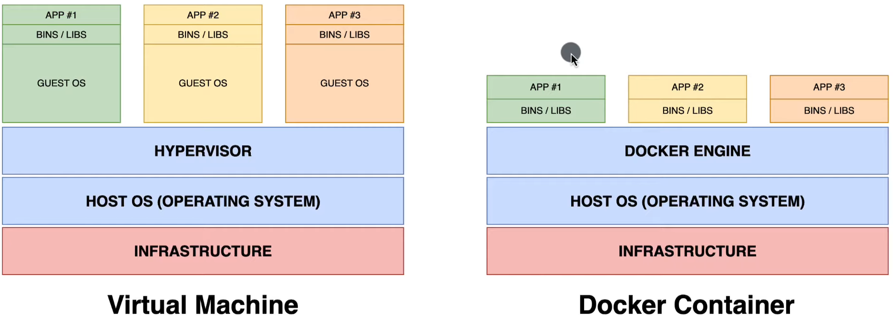
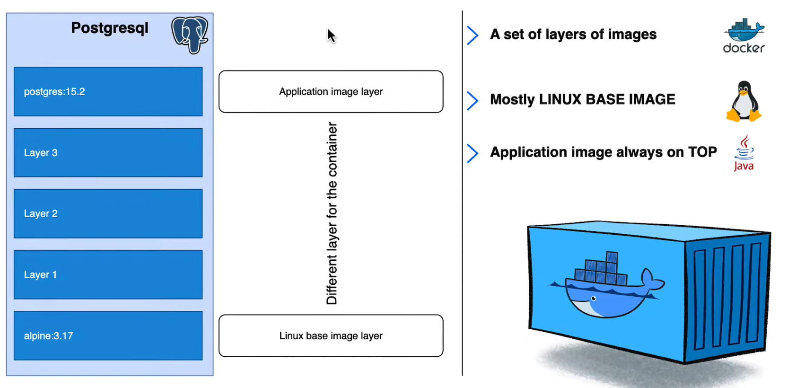
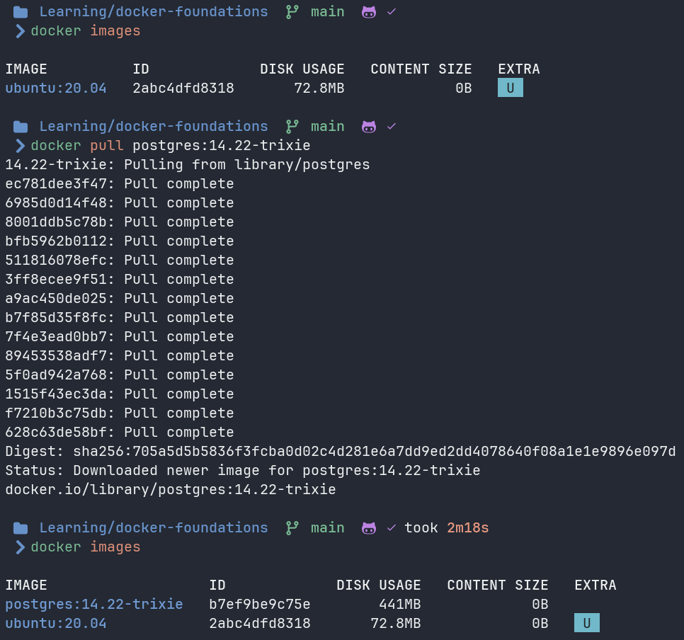

## 1. What is Container?

Lightweight, standalone, and executable software package that includes everything needed to run a piece of software. Simplifies development, deployment and scaling.

> [!IMPORTANT]
> Containers are designed to provide a consistent and reproducible environment across different platforms and development stages.

**Containers benefits** are Consistency, Portability, Resource Efficiency, Scalability, and Versioning and Rollback. 

### 1.1. Where are Containers?

The container can be to include the code runtime system, tools, libraries, and settings. **Container Registries** are services that store and distribute container images allowing developers and creators to push pull and manage images of their application.

Some popular container registries are **Docker Hub, Google Container registry, AWS elastic container registries**, etc. 

There are 3 types of containers:

1. Container repositories. We call them self-hosted registries like [Nexus repository](https://www.sonatype.com/products/sonatype-nexus-repository)
2. Private repositories.
3. Public repositories like [Docker Hub](https://hub.docker.com/)

> [!NOTE]
> When deploying a containerized application, the container runtime like Docker, it pulls the relevant container image from the specified registry, it creates a container from the image and it runs it on the host system. 

### 1.2. Virtual Machine VS Docker Container

Docker containers share the host operating system and run as isolated user space processes. This approach results in lower resource overhead faster startup times and increased density of applications per host compared to Virtual Machine.  



> [!IMPORTANT]
> **Docker** is weel suited for microservices cloud native applications and situations where you need to deploy and scale application **quickly** with minimal overhead.
>Whereas, **Virtual machines** are more appropiate for running application with strong isolation requirements, legacy applications or when you need to run multiple operating system instances on the same host.

## 2. What is a Docker Container?

It is a set of layers of images as we can see in the following image.



### 2.1. What is a image?

A Docker image is a lightweight, standalone, and immutable template that contains everything needed to run an application. It serves as a blueprint for creating Docker containers.

**Components of a Docker image**

Base layer (minimal operating system like Alpine Linux), Application dependencies (libraries, packages, and tools), Application code (actual code and files that make up your application), and Configuration (environment variables, exposed ports, and startup commands)

> [!IMPORTANT]
> When you run a Docker container, it creates a thin writable layer on top of the read-only image layers. Any changes made during container runtime are stored in this writable layer, while the underlying image remains unchanged.

### 2.1. Let’s started with the docker commands

We going to pull a [Postgres image](https://hub.docker.com/_/postgres) from Docker Hub.

```bash
docker pull postgres:14.22-trixie 
```



Eah hash is a layer and when we did a `docker pull` it started pulling the layers one by one.

**Commands about Images**

```bash
docker pull [OPTIONS] <IMAGE>
docker images [OPTIONS] <IMAGE> # Show images
docker image rm <IMAGE> # Remove a imagen
```

**Commands about containers**

We need fast commads to run a new container

```bash
docker run [OPTIONS] <IMAGE> # pull image, create container, and run container
docker run -d <IMAGE> # Background run
docker run --name <NAME_CONTAINER> <IMAGE> # set a alias instead hash
docker ps # Show running container
docker ps -a # Show all containers 
docker stop <HASH | NAME_CONTAINER> # Stop a container
```

## Port Mapping
Docker utiliza un modelo de red en el que los contenedores se ejecutan en su propia red aislada. Por defecto, los contenedores no pueden ser accedidos desde fuera de esta red aislada

Si alguna aplicación dentro de tu contenedor necesita ser accesible desde fuera de este, necesitas especificar explícitamente qué puertos del contenedor deben ser mapeados a puertos en la máquina host.

Entonces podemos decir que cualquier conexión o solicitud que llegue al puerto 'x' de la maquina host, será mapeada al puerto 'y' del contenedor.


> Crear un contenedor con por mapping
```sh
$ docker create -p <PORT_HOST_MACHINE>:<PORT_CONTAINER> --name <NAME_CONTAINER> <IMAGE>

```

## Questions
1. Por qué cuando creo e inicio manualmente un contenedor con una imagen de ubuntu:20.04, el contenedor se inicia y se detiene inmediatamente.

2. Por qué al crear e iniciar dicho contenedor con el comando 'run' y pasandole la opcion -it recien el contenedor comienza y no se detiene inmediatamente.

3. Si partimos de la idea de que al hacer manual el inicio del contenedor, nosotros no estamos pasando ningún proceso al contenedor y es por ello que se detiene inmediatamente. Entonces por qué cuando detengo el contenedor y lo deseo iniciar nuevamente, y lo hago con el comando 'start' recien ahora pasa que el contenedor no se detiene inmediatamente.


